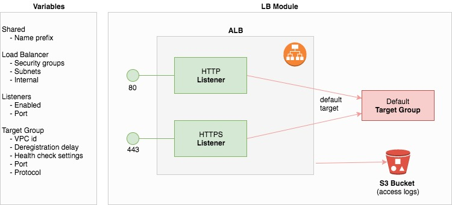

[](https://circleci.com/gh/tieto-cem/terraform-aws-alb)

Terraform ALB module
====================

Terraform module for creating ALB resources. 


Overview
--------

This module creates ALB, listeners (HTTP / HTTPS), default target group and access log bucket.




Usage
-----

```hcl

provider "aws" {
  region = "eu-west-1"
}

data "aws_vpc" "default_vpc" {
  default = true
}

data "aws_subnet_ids" "public_subnet_ids" {
  vpc_id = "${data.aws_vpc.default_vpc.id}"
}

module "alb" {
  source                 = "github.com/tieto-cem/terraform-aws-alb?ref=v0.1.0"
  name_prefix            = "alb-example"
  lb_internal            = false
  lb_subnet_ids          = "${data.aws_subnet_ids.public_subnet_ids.ids}"
  lb_security_group_ids  = ["sg-12345678"]
  tg_vpc_id              = "${data.aws_vpc.default_vpc.id}"
  http_listener_enabled  = true
  https_listener_enabled = false
}
```

Resource naming
---------------

This module names AWS resources as follows:

| Name                               | Type           | 
|------------------------------------|----------------|
|${var.name_prefix}-alb              | Load Balancer  |
|${var.name_prefix}-default-tg       | Target Group   |
|${var.name_prefix}-alb-access-logs  | S3 Bucket      |    
 


Example
-------

* [Simple example](https://github.com/tieto-cem/terraform-aws-alb/tree/master/example)